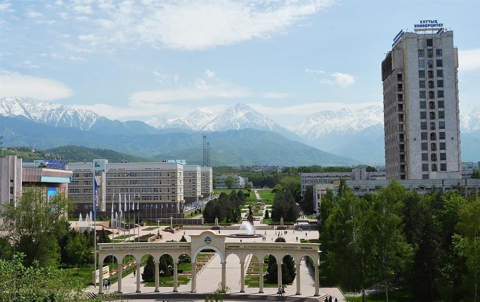

## About me :mortar_board:

<em>Studying Computer Science at <a href="https://en.wikipedia.org/wiki/Al-Farabi_Kazakh_National_University">KazNU</a>. GPA: 3.85/4 💻 
  
</em>

🛠 Programming languages and technologies: 
  - Java (OOP, Concurrency (udp/tcp: "Client-server" project), Collection API), servlet-jsp, Spring Data JPA, asp.Net, .net core
  - Python (opencv-cv2)
  - Maven, JUnit, Git
  - Microsoft SQL Server, MySQL (JDBC, ODBC), PostgreSQL, AWS s3
  - WEKA

🌏 Languages:
  - Kazakh — Native
  - English — B2 — Upper Intermediate
  - Russian — C1 — Advanced
  - Turkish — A1 — Basic

## My Certifications
- [Coursera and Stepik](https://github.com/AxelrodAdil/Certificates)
